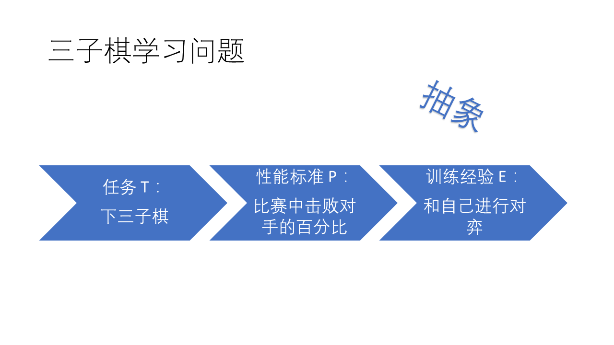
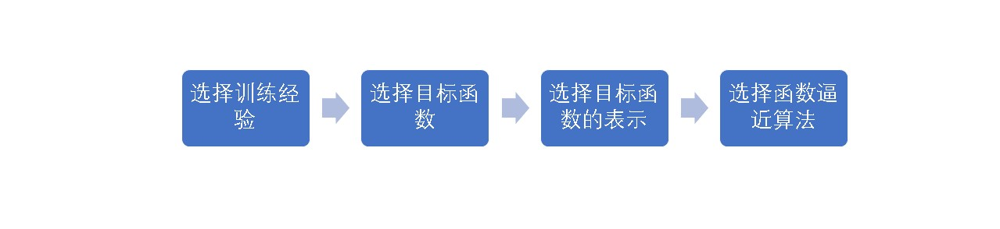
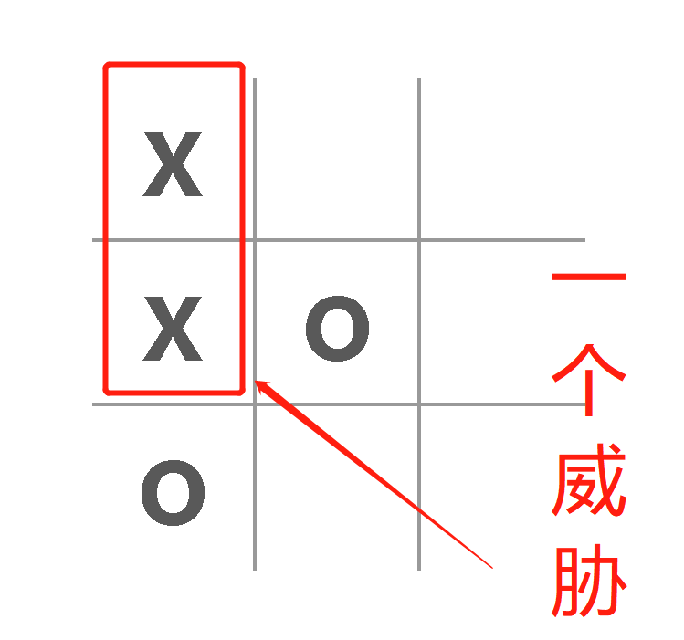
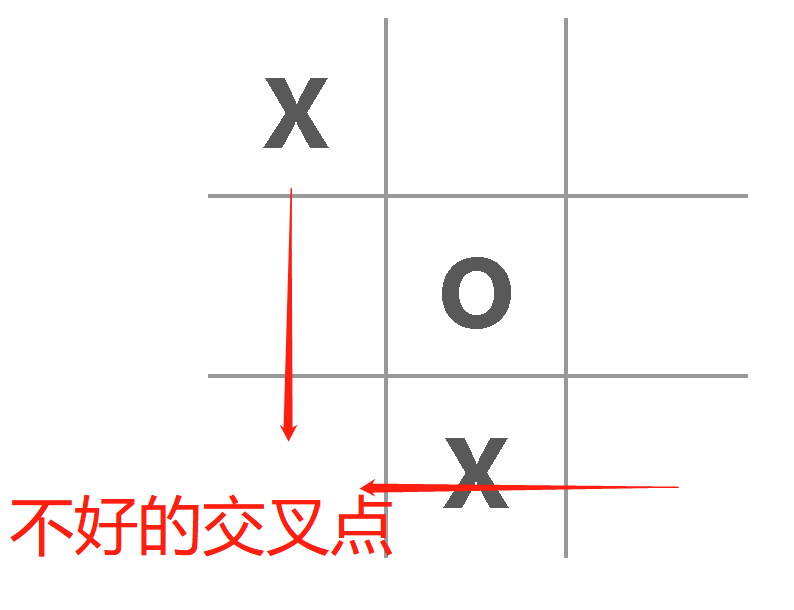
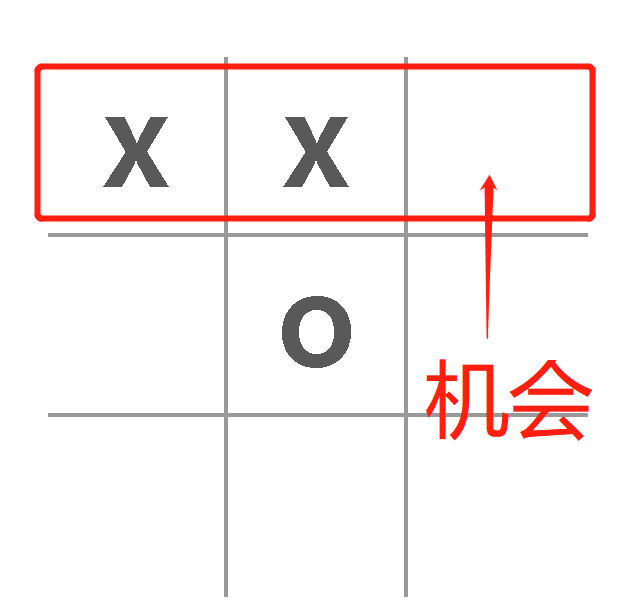
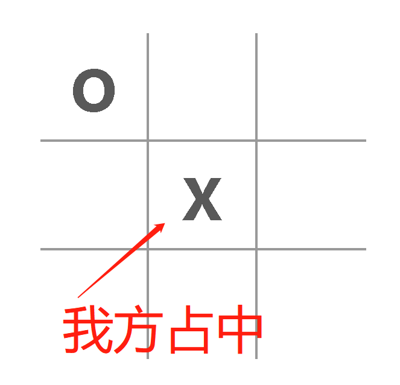
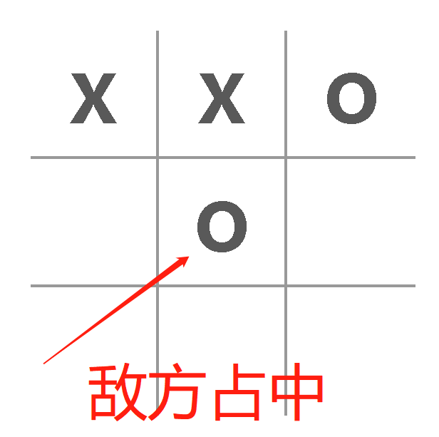
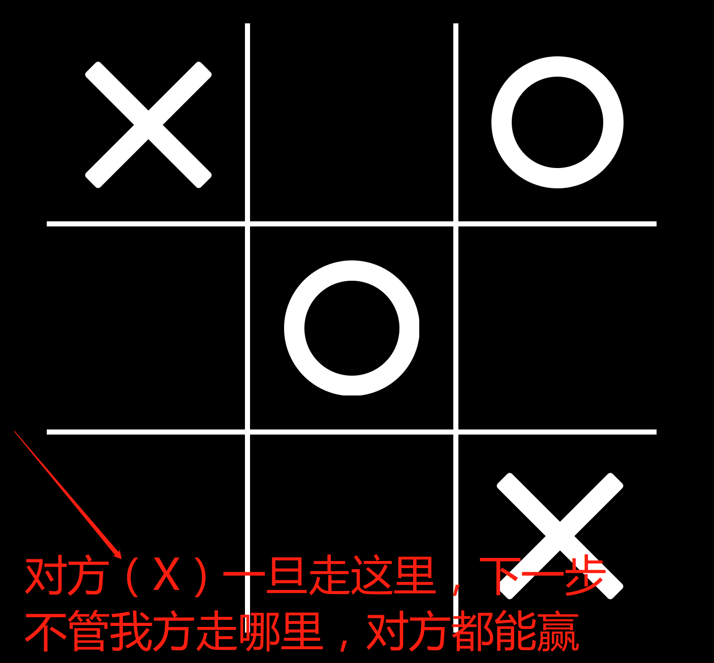
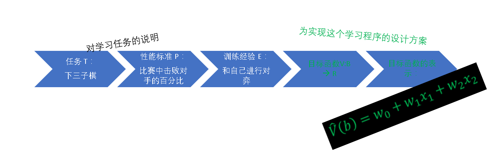

# Deconstruct this program - The ABC of machine learning

## How does it works?
The core of this project uses the basic steps of the machine learning methodology, and the frontend part uses ReactJs, totally based on the [classic React tic-tac-toe tutorial](https://reactjs.org/tutorial/tutorial.html).

For the style part, it uses [Alibaba Ant Design Mobile](https://mobile.ant.design).

This document will put focus on the machine learning because the frontend part is detailed in the above links.

## What is Machine Learning?
Let's look at the definition of a typical textbook:
> Given a task T and performance measure  P, if a computer program can improve its performance in terms of P on the task T, then we say that this computer program is learning from experience E.

Take the computer program of learning play tic tac toe game for example, it can get experience from playing the game with itself; its task is playing the tic tac toe game; and its performance is measured by the ability of winning the game.

## How to design a learning system?
The general steps:

## Choose training experience
This program chooses 2 ways:
* Generate random valid game board: Before this program published to public, it plays with the randomly generated yet valid game board.

* Play with real human players: After the program was published to public, it plays with real human players and adjusted its internal evaluation function(or target function)'s weights of arguments.

## Choose target function
For any board status b in set B, we define the following target function V(b):

* If b is a terminal winning status, the V(b) = π/2
* If b is a terminal losing status, then V(b) = -π/2
* If b is a terminal draw status, then V(b) = 0
* If b is not a terminal status, in other words, the game is in progress, then V(b) = V(b’), where b’ is the terminal status which starts from b and both the players tried their best in the game. (It's a recursive progress, so we need the functional approximation algorithm)

## Choose the presentation of the target function
This program present V(b) as a linear function:
V(b) = w0 + w1 x1 + w2 x2 + w3 x3 + w4 x4 + w5 x5, where w0 to w5 are the numeric coefficients, or the weights, decided by the learning algorithm.
The x1 to x5 are the board status values, and w1 to w5 decides the relative importance of the different game board characterizations, notice the w0 is an extra board status constant.
After some experiences, this program finally chooses the following board status values:
* x1: The sides of threatened. There are 8 sides in total, if there are 2 component (X) appears and at the same time there is no O appears on the same side, then this side is threatened by component. So the values can be 0 to 8.

* x2: The intersected points of bad sides. If there are intersected 2 sides which each of them contains 1 component and 2 empty squares, then this is called a bad intersection.

* x3: Sides of chances. If a side contains 2 Os and a empty square, then this side is a chance side.

* x4: Occupied center. If the center square is O then the value of x4 is 1;  is X then x4 -1; empty then x4 0.

|O occupied center|X occupied center|
|-------|-------|
|||
* x5: The threatens brought by our chance point. As described earlier, if one side contains 2 O's and an empty square, then it is our chance. But if the component place X at this empty square and make the board generated 2 threatens at a time, then it blocks us from wining and will win us after whatever steps we take.

## Retrospective
The problem of learning playing tic tac toe game is now simplified to learning the presentation of the target function's coefficient values of `w0` to `w5`.

## Choose the functional approximation
This process is also called estimate training values, in other words, the process of choosing weight values. We can start from whatever values and then update them util the better values are found.
This program uses LMS (Least Mean Squares) method, which can adjust the weights along the direction of decrease the training data errors.

## Done
Generally speaking, in this way, the program becomes very smart by playing 6 to 7 round of games, and after 7 steps it is hard to beat.

[Try it yourself](https://jeff-tian.github.io/tic-tac-toe-ai/)

## Support
Support is welcome if you find this project helpful. The Alipay is recommended because both of us can benefit from its red packages.

|Get red package|Support me|
|-----|----|
|||