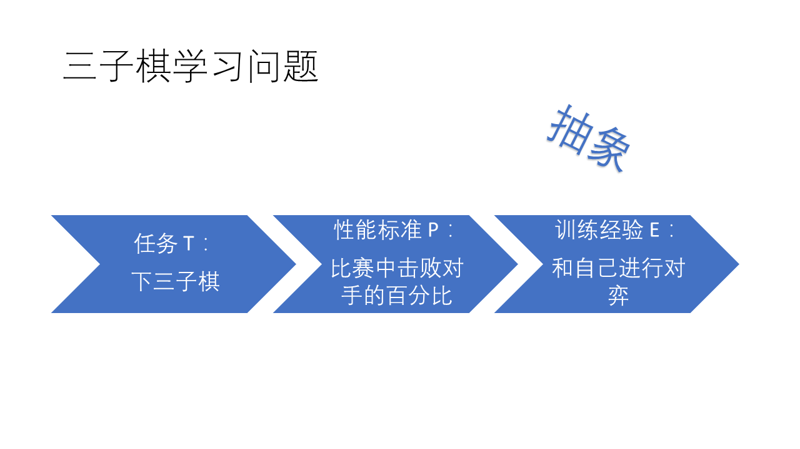
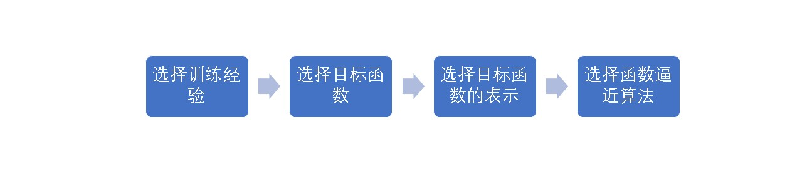
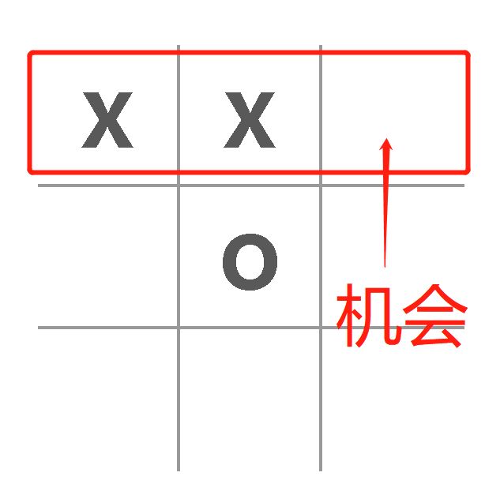
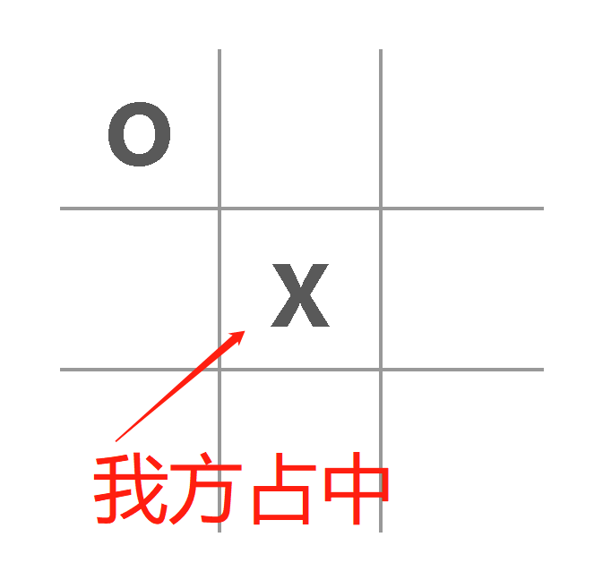
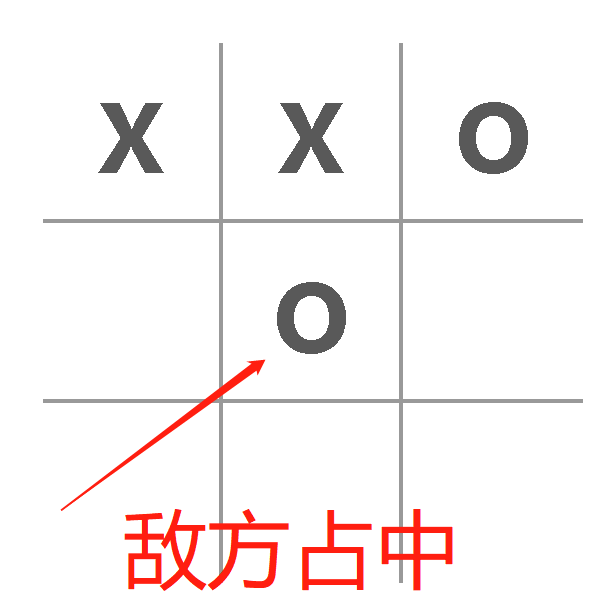
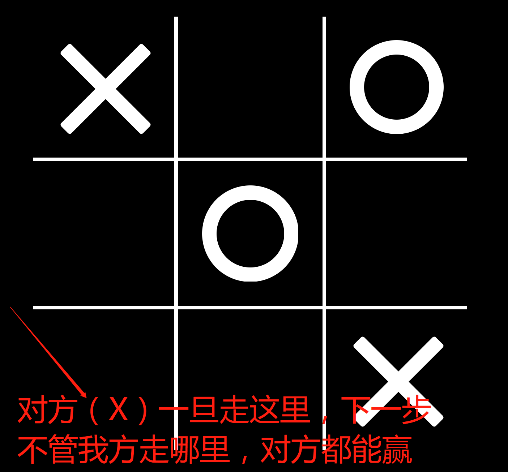
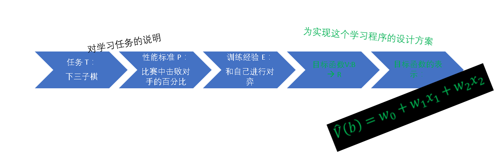

# 解构本三子棋程序 —— 机器学习入门

## 这个程序是怎么写成的？
本程序的核心使用了机器学习的通用步骤，前端呈现模块使用了 ReactJS，而且是基于[React 的经典 tic-tac-toe 教程](https://reactjs.org/tutorial/tutorial.html)。

样式使用了[阿里的 And Design Mobile](https://mobile.ant.design)。

前端的部分这里不多说，大家可以通过以上链接进行学习。本文将集中介绍一下机器学习部分。

## 那么什么是机器学习呢？
我们看一下教科书的定义：
> 对于某类任务 T 和性能度量 P，如果一个计算机程序在 T 上以 P 衡量的性能随着经验 E 而自我完善，那么我们称这个计算机程序在从经验 E 中 学习 。

例如：对于学习下三子棋的计算机程序，它可以通过和自己下棋获取经验；它的任务是参与三子棋对弈；它的性能用它赢棋的能力来衡量。

## 那么如何来设计一个学习系统呢？
一般有以下几个步骤：

## 选择训练经验
本程序选择了两种：
* 产生随机的合法棋局：本程序在公开访问之前，可以通过和随机的合法棋局对弈
* 和玩家对弈：本程序在对外公开访问之后，可以和真实的玩家进行对弈，并不断调整自身内部的评估函数（目标函数）参数的权值。

## 选择目标函数
对于集合 B 中的任意棋局状态 b，我们如下定义目标函数 V(b)：

* 如果 b 是一最终的胜局，那么 V(b) = π/2
* 如果 b 是一最终的负局，那么 V(b) = -π/2
* 如果 b 是一最终的和局，那么 V(b) = 0
* 如果 b 不是最终棋局，那么 V(b) = V(b’)，其中 b’ 是从 b 开始双方都采取最优对弈后可达到的终局。（递归，所以需要后面的一步：函数逼近算法）

## 选择目标函数的表示
本学习程序把 V(b) 表示成一个线性函数：
V(b) = w0 + w1 x1 + w2 x2 + w3 x3 + w4 x4 + w5 x5，其中 w0 到 w5 为数字系数，或者叫做权，由学习算法来选择。而 x1 到 x5 为棋盘状态值，权 w1 到 w5 决定了不同的棋盘特征的相对重要性，而权 w0 为一个附加的棋盘状态值常量。  
本程序经过一些实验，最后选择了如下的棋盘状态值：
* x1：棋盘上受到对方威胁的边数（一共8条边，如果一条边上出现两颗敌子并且没有我方棋子，那么这条边形成了对我方的威胁），取值范围是0到8。

* x2：不好的情况的交叉点数。如果两条边上各有一个敌方棋子而没有我方棋子，并且这两边交叉，那么就有一个不好的情况交叉点。

* x3: 机会边数。如果有一条边有我方两个棋子而没有对方棋子，那这就是一个机会边数。

* x4：占中优势。如果中间格子是我方棋子，那么我方占据了优势，x4 的值记为 1；如果是空，则记为 0；如果是敌方棋子，则记为 -1。

|我方占中|敌方占中|
|-------|-------|
|||
* x5：我方的赢面机会带来的威胁数。如果我方某边上已有两个棋子，另一个格子为空。如果我方占据这个空格就能赢棋，但是现在轮到对方走。如果对方占据这个空格，不仅阻碍了我方的赢棋，还同时让两条边以上拥有敌方的两颗棋子而另外一格是空的这种情况，那么下一步不管我走哪里，对方总能赢，这就带来了威胁。

## 回顾
这样，学习三子棋战略的问题被简化为学习目标函数表示中系数 `w0` 到 `w5` 值的问题。

## 选择函数逼近
这个过程也被称作估计训练值，就是选择权重值的过程。我们可以从任意的权重值开始，然后不断调整权值，最终找到一个比较好的权重值组合。
本程序采用了 LMS 最小均方法，对于每一个训练样例，它能把权值向减小这个训练数据误差的方向略为调整。

## 完成
一般通过 6 到 7 次的训练，也就是和这个程序下 6 到 7 次棋，它就“学习”得很聪明了，几乎再也赢不了它了。

[不信，你试试？](https://jeff-tian.github.io/tic-tac-toe-ai/)

## 打赏
如果你觉得本文对你有用，欢迎向我打赏。推荐使用支付宝，先领取红包再打赏。

|领红包|打赏|
|-----|----|
|||